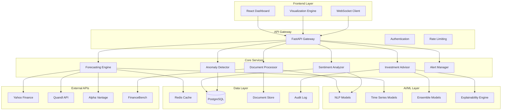

# Advanced Financial Intelligence System - Design Document

## Overview

The Advanced Financial Intelligence System is a comprehensive AI-powered platform built on a modern microservices architecture using FastAPI (backend) and React (frontend). The system extends the existing FinDocGPT foundation to provide institutional-grade financial analysis capabilities including advanced document processing, multi-modal sentiment analysis, sophisticated anomaly detection, ensemble forecasting, and explainable investment recommendations.

The design emphasizes scalability, real-time performance, and extensibility while maintaining the existing clean separation between frontend and backend services. The system integrates multiple AI models, external data sources, and provides comprehensive audit trails for regulatory compliance.

## Architecture

### High-Level Architecture



### Service Architecture

The system follows a modular service-oriented architecture where each core capability is implemented as a dedicated service:

1. **Document Processor Service**: Handles document ingestion, parsing, indexing, and contextual Q&A
2. **Sentiment Analysis Service**: Performs multi-dimensional sentiment analysis on financial communications
3. **Anomaly Detection Service**: Identifies statistical outliers and unusual patterns in financial metrics
4. **Forecasting Engine Service**: Generates multi-horizon predictions using ensemble models
5. **Investment Advisor Service**: Produces actionable recommendations with explainable reasoning
6. **Alert Manager Service**: Manages real-time notifications and critical alerts

## Components and Interfaces

### Document Processor Service

**Purpose**: Advanced document ingestion, processing, and contextual Q&A capabilities

**Key Components**:
- **Document Parser**: Multi-format document parsing (PDF, HTML, TXT, JSON)
- **Content Indexer**: Vector-based document indexing using sentence transformers
- **Context Manager**: Maintains relationships between documents and companies
- **Q&A Engine**: Advanced question-answering using fine-tuned financial language models

**Interfaces**:
```python
class DocumentProcessor:
    async def ingest_document(self, file: UploadFile, metadata: DocumentMetadata) -> DocumentID
    async def ask_question(self, question: str, context: QueryContext) -> QAResponse
    async def get_document_insights(self, doc_id: DocumentID) -> DocumentInsights
    async def search_documents(self, query: str, filters: SearchFilters) -> List[DocumentMatch]
```

**Enhanced Features**:
- Multi-document contextual understanding
- Automatic entity extraction (companies, financial metrics, dates)
- Document relationship mapping
- Source citation and confidence scoring

### Sentiment Analysis Service

**Purpose**: Multi-dimensional sentiment analysis across various financial communication types

**Key Components**:
- **Text Preprocessor**: Financial text cleaning and normalization
- **Multi-Model Analyzer**: Ensemble of FinBERT, RoBERTa, and custom financial sentiment models
- **Topic Extractor**: Identifies sentiment for specific financial topics
- **Trend Analyzer**: Tracks sentiment changes over time

**Interfaces**:
```python
class SentimentAnalyzer:
    async def analyze_document_sentiment(self, doc_id: DocumentID) -> SentimentAnalysis
    async def analyze_topic_sentiment(self, text: str, topics: List[str]) -> TopicSentiment
    async def get_sentiment_trends(self, company: str, timeframe: TimeRange) -> SentimentTrends
    async def compare_sentiment(self, companies: List[str]) -> SentimentComparison
```

**Enhanced Features**:
- Topic-specific sentiment analysis (management outlook, competitive position, etc.)
- Sentiment confidence scoring and uncertainty quantification
- Historical sentiment trend analysis
- Cross-company sentiment comparison

### Anomaly Detection Service

**Purpose**: Statistical anomaly detection in financial metrics and patterns

**Key Components**:
- **Statistical Analyzer**: Multiple statistical tests for outlier detection
- **Pattern Detector**: Machine learning models for complex pattern anomalies
- **Baseline Manager**: Dynamic baseline establishment and maintenance
- **Risk Assessor**: Contextual risk evaluation of detected anomalies

**Interfaces**:
```python
class AnomalyDetector:
    async def detect_metric_anomalies(self, company: str, metrics: List[str]) -> List[Anomaly]
    async def analyze_pattern_anomalies(self, data: TimeSeriesData) -> PatternAnomalies
    async def assess_anomaly_risk(self, anomaly: Anomaly) -> RiskAssessment
    async def get_anomaly_history(self, company: str) -> AnomalyHistory
```

**Enhanced Features**:
- Multi-metric correlation analysis
- Dynamic threshold adjustment based on market conditions
- Anomaly severity classification
- Contextual explanation generation

### Forecasting Engine Service

**Purpose**: Multi-horizon financial forecasting using ensemble methods

**Key Components**:
- **Data Aggregator**: Collects and normalizes data from multiple sources
- **Model Ensemble**: Prophet, ARIMA, LSTM, and transformer-based models
- **Uncertainty Quantifier**: Confidence interval and prediction uncertainty estimation
- **Performance Monitor**: Model performance tracking and automatic retraining

**Interfaces**:
```python
class ForecastingEngine:
    async def forecast_stock_price(self, ticker: str, horizons: List[int]) -> StockForecast
    async def forecast_financial_metrics(self, company: str, metrics: List[str]) -> MetricForecast
    async def get_forecast_confidence(self, forecast_id: str) -> ConfidenceMetrics
    async def update_model_performance(self, model_id: str, actual_values: List[float]) -> None
```

**Enhanced Features**:
- Multi-horizon forecasting (1, 3, 6, 12 months)
- Ensemble model combination with dynamic weighting
- External factor integration (market sentiment, economic indicators)
- Automated model selection and hyperparameter optimization

### Investment Advisor Service

**Purpose**: Generate actionable investment recommendations with explainable reasoning

**Key Components**:
- **Signal Aggregator**: Combines insights from all analysis services
- **Decision Engine**: Multi-criteria decision making with configurable weights
- **Risk Calculator**: Position sizing and risk assessment
- **Explanation Generator**: Natural language explanation of recommendations

**Interfaces**:
```python
class InvestmentAdvisor:
    async def generate_recommendation(self, ticker: str, context: AnalysisContext) -> InvestmentRecommendation
    async def explain_recommendation(self, recommendation_id: str) -> RecommendationExplanation
    async def assess_portfolio_risk(self, portfolio: Portfolio) -> RiskAssessment
    async def optimize_position_sizing(self, recommendations: List[InvestmentRecommendation]) -> PositionSizes
```

**Enhanced Features**:
- Multi-factor recommendation scoring
- Risk-adjusted position sizing
- Transparent decision reasoning
- Recommendation confidence scoring

### Real-Time Dashboard Service

**Purpose**: Live data visualization and interactive financial intelligence interface

**Key Components**:
- **WebSocket Manager**: Real-time data streaming to frontend
- **Visualization Engine**: Dynamic chart and graph generation
- **Alert System**: Real-time notification management
- **Performance Monitor**: System and model performance tracking

**Interfaces**:
```python
class DashboardService:
    async def stream_market_data(self, watchlist: List[str]) -> AsyncGenerator[MarketUpdate]
    async def get_dashboard_config(self, user_id: str) -> DashboardConfig
    async def update_watchlist(self, user_id: str, watchlist: List[str]) -> None
    async def trigger_alert(self, alert: Alert) -> None
```

## Data Models

### Core Data Models

```python
from pydantic import BaseModel
from typing import List, Optional, Dict, Any
from datetime import datetime
from enum import Enum

class DocumentMetadata(BaseModel):
    company: str
    document_type: str  # earnings_report, sec_filing, press_release
    filing_date: datetime
    period: str  # Q1 2024, FY 2023
    source: str

class QAResponse(BaseModel):
    answer: str
    confidence: float
    sources: List[str]
    related_questions: List[str]

class SentimentAnalysis(BaseModel):
    overall_sentiment: float  # -1 to 1
    confidence: float
    topic_sentiments: Dict[str, float]
    sentiment_explanation: str
    historical_comparison: Optional[float]

class Anomaly(BaseModel):
    metric_name: str
    current_value: float
    expected_value: float
    deviation_score: float
    severity: str  # low, medium, high, critical
    explanation: str
    historical_context: str

class StockForecast(BaseModel):
    ticker: str
    forecasts: Dict[int, float]  # horizon -> predicted_price
    confidence_intervals: Dict[int, tuple]  # horizon -> (lower, upper)
    model_performance: Dict[str, float]
    last_updated: datetime

class InvestmentSignal(Enum):
    STRONG_BUY = "STRONG_BUY"
    BUY = "BUY"
    HOLD = "HOLD"
    SELL = "SELL"
    STRONG_SELL = "STRONG_SELL"

class InvestmentRecommendation(BaseModel):
    ticker: str
    signal: InvestmentSignal
    confidence: float
    target_price: Optional[float]
    risk_level: str
    position_size: Optional[float]
    reasoning: str
    supporting_factors: List[str]
    risk_factors: List[str]
    time_horizon: str
```

### Database Schema

**Documents Table**:
```sql
CREATE TABLE documents (
    id UUID PRIMARY KEY,
    company VARCHAR(10) NOT NULL,
    document_type VARCHAR(50) NOT NULL,
    filing_date TIMESTAMP NOT NULL,
    period VARCHAR(20),
    content TEXT NOT NULL,
    metadata JSONB,
    vector_embedding VECTOR(768),
    created_at TIMESTAMP DEFAULT NOW()
);
```

**Sentiment Analysis Table**:
```sql
CREATE TABLE sentiment_analysis (
    id UUID PRIMARY KEY,
    document_id UUID REFERENCES documents(id),
    overall_sentiment FLOAT NOT NULL,
    confidence FLOAT NOT NULL,
    topic_sentiments JSONB,
    analysis_timestamp TIMESTAMP DEFAULT NOW()
);
```

**Anomalies Table**:
```sql
CREATE TABLE anomalies (
    id UUID PRIMARY KEY,
    company VARCHAR(10) NOT NULL,
    metric_name VARCHAR(100) NOT NULL,
    current_value FLOAT NOT NULL,
    expected_value FLOAT NOT NULL,
    deviation_score FLOAT NOT NULL,
    severity VARCHAR(20) NOT NULL,
    detected_at TIMESTAMP DEFAULT NOW(),
    resolved_at TIMESTAMP NULL
);
```

**Forecasts Table**:
```sql
CREATE TABLE forecasts (
    id UUID PRIMARY KEY,
    ticker VARCHAR(10) NOT NULL,
    horizon_days INTEGER NOT NULL,
    predicted_value FLOAT NOT NULL,
    confidence_lower FLOAT NOT NULL,
    confidence_upper FLOAT NOT NULL,
    model_name VARCHAR(50) NOT NULL,
    created_at TIMESTAMP DEFAULT NOW(),
    actual_value FLOAT NULL,
    accuracy_score FLOAT NULL
);
```

## Error Handling

### Error Classification

1. **Data Errors**: Missing data, invalid formats, API failures
2. **Model Errors**: Prediction failures, low confidence, model unavailability
3. **System Errors**: Service unavailability, timeout, resource constraints
4. **Business Logic Errors**: Invalid parameters, constraint violations

### Error Handling Strategy

```python
class FinancialIntelligenceError(Exception):
    def __init__(self, message: str, error_code: str, context: Dict[str, Any] = None):
        self.message = message
        self.error_code = error_code
        self.context = context or {}
        super().__init__(self.message)

class ErrorHandler:
    @staticmethod
    async def handle_data_error(error: Exception, context: Dict[str, Any]) -> ErrorResponse:
        # Log error, attempt data recovery, provide fallback
        pass
    
    @staticmethod
    async def handle_model_error(error: Exception, model_name: str) -> ErrorResponse:
        # Switch to backup model, adjust confidence, notify monitoring
        pass
    
    @staticmethod
    async def handle_system_error(error: Exception, service_name: str) -> ErrorResponse:
        # Circuit breaker, graceful degradation, alert operations
        pass
```

### Graceful Degradation

- **Document Q&A**: Fall back to keyword search if NLP models fail
- **Sentiment Analysis**: Use rule-based sentiment if ML models unavailable
- **Forecasting**: Provide historical averages if prediction models fail
- **Recommendations**: Generate conservative recommendations with reduced confidence

## Testing Strategy

### Unit Testing

**Coverage Requirements**: 90% code coverage for all services

**Key Test Categories**:
- Model prediction accuracy tests
- Data validation and transformation tests
- API endpoint functionality tests
- Error handling and edge case tests

**Example Test Structure**:
```python
class TestDocumentProcessor:
    async def test_document_ingestion_success(self):
        # Test successful document processing
        pass
    
    async def test_document_ingestion_invalid_format(self):
        # Test error handling for invalid formats
        pass
    
    async def test_qa_response_accuracy(self):
        # Test Q&A accuracy against known answers
        pass
    
    async def test_qa_confidence_scoring(self):
        # Test confidence score reliability
        pass
```

### Integration Testing

**Service Integration Tests**:
- End-to-end workflow testing (document upload → analysis → recommendation)
- External API integration testing with mock services
- Database integration and data consistency tests
- WebSocket real-time communication tests

**Performance Testing**:
- Load testing for concurrent document processing
- Stress testing for high-frequency market data updates
- Memory usage testing for large document processing
- Response time testing for all API endpoints

### Model Testing

**Model Performance Tests**:
- Backtesting forecasting models against historical data
- A/B testing different model configurations
- Drift detection for model performance degradation
- Bias testing for recommendation fairness

**Data Quality Tests**:
- Data validation and schema compliance tests
- External API data consistency tests
- Historical data integrity verification
- Real-time data freshness monitoring

### User Acceptance Testing

**Functional Testing**:
- User workflow testing for all major features
- Dashboard responsiveness and visualization accuracy
- Mobile and cross-browser compatibility testing
- Accessibility compliance testing

**Performance Testing**:
- User experience performance benchmarks
- Dashboard load time optimization
- Real-time update responsiveness
- System reliability under normal usage patterns

## Implementation Considerations

### Scalability

- **Horizontal Scaling**: Containerized services with Kubernetes orchestration
- **Database Scaling**: Read replicas for query performance, partitioning for large datasets
- **Caching Strategy**: Redis for frequently accessed data, CDN for static assets
- **Load Balancing**: API gateway with intelligent routing and rate limiting

### Security

- **Authentication**: JWT-based authentication with refresh tokens
- **Authorization**: Role-based access control (RBAC) for different user types
- **Data Encryption**: Encryption at rest and in transit for sensitive financial data
- **API Security**: Rate limiting, input validation, and SQL injection prevention

### Monitoring and Observability

- **Application Monitoring**: Comprehensive logging, metrics, and distributed tracing
- **Model Monitoring**: Performance tracking, drift detection, and automated retraining
- **Business Metrics**: User engagement, prediction accuracy, and recommendation success rates
- **Infrastructure Monitoring**: Resource utilization, service health, and alert management

### Compliance and Audit

- **Audit Trails**: Complete logging of all user actions and system decisions
- **Data Governance**: Data lineage tracking and retention policy enforcement
- **Regulatory Compliance**: SOX, GDPR, and financial industry regulation compliance
- **Model Explainability**: Transparent decision-making processes for regulatory review