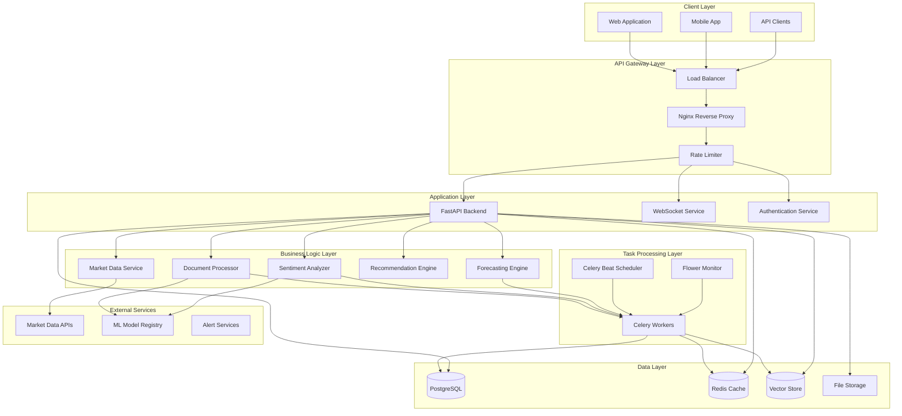
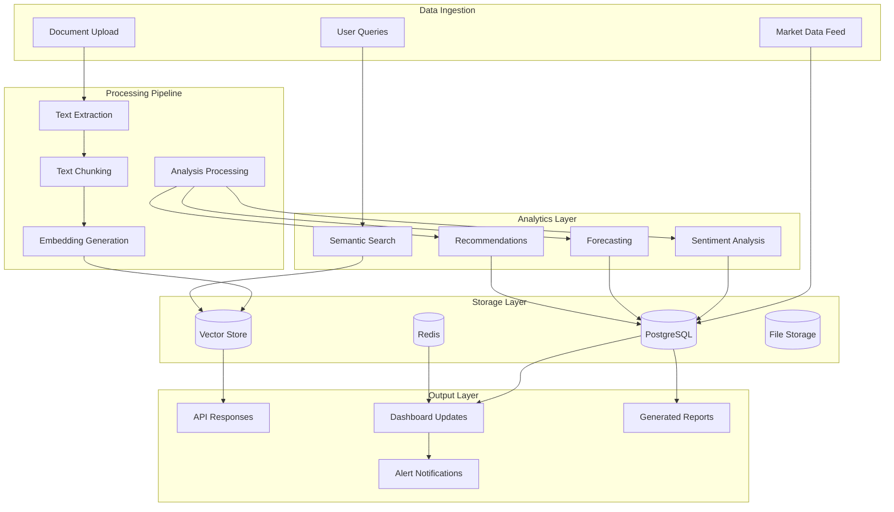

# System Architecture

This document provides a comprehensive overview of the Financial Intelligence System architecture, including system design, component interactions, data flow, and technical decisions.

## Table of Contents

1. [Architecture Overview](#architecture-overview)
2. [System Components](#system-components)
3. [Data Architecture](#data-architecture)
4. [Service Architecture](#service-architecture)
5. [Security Architecture](#security-architecture)
6. [Deployment Architecture](#deployment-architecture)
7. [Scalability and Performance](#scalability-and-performance)
8. [Monitoring and Observability](#monitoring-and-observability)
9. [Integration Patterns](#integration-patterns)
10. [Technology Stack](#technology-stack)

## Architecture Overview

The Financial Intelligence System follows a modern microservices architecture with clear separation of concerns, designed for scalability, maintainability, and high availability.

### High-Level Architecture



### Design Principles

1. **Separation of Concerns**: Clear boundaries between presentation, business logic, and data layers
2. **Scalability**: Horizontal scaling capabilities for all components
3. **Resilience**: Fault tolerance and graceful degradation
4. **Security**: Defense in depth with multiple security layers
5. **Observability**: Comprehensive monitoring, logging, and tracing
6. **Maintainability**: Clean code, documentation, and testing practices

## System Components

### Frontend Layer

#### Web Application (React)
- **Technology**: React 18 with Vite
- **Styling**: Tailwind CSS for responsive design
- **State Management**: React hooks and context
- **Charts**: Chart.js and Recharts for data visualization
- **Real-time**: WebSocket integration for live updates

**Key Features:**
- Responsive dashboard with financial metrics
- Document upload and analysis interface
- Interactive charts and visualizations
- Real-time market data updates
- Investment recommendation display

#### Component Architecture
```
src/
├── components/          # Reusable UI components
│   ├── charts/         # Chart components
│   ├── forms/          # Form components
│   └── ui/             # Basic UI elements
├── pages/              # Page-level components
├── hooks/              # Custom React hooks
├── services/           # API service layer
└── utils/              # Utility functions
```

### Backend Layer

#### FastAPI Application
- **Framework**: FastAPI with Python 3.8+
- **ASGI Server**: Uvicorn for production deployment
- **API Documentation**: Automatic OpenAPI/Swagger generation
- **Validation**: Pydantic models for request/response validation

**Core Modules:**
- **Routes**: API endpoint definitions
- **Services**: Business logic implementation
- **Models**: Data models and schemas
- **Middleware**: Cross-cutting concerns (auth, logging, CORS)
- **Dependencies**: Dependency injection for services

#### Service Layer Architecture
```
app/
├── routes/             # API route definitions
├── services/           # Business logic services
├── models/             # Pydantic models
├── database/           # Database operations
├── middleware/         # Custom middleware
├── utils/              # Utility functions
├── tasks/              # Background tasks
└── monitoring/         # Health checks and metrics
```

### Data Processing Layer

#### Document Processing Service
- **Text Extraction**: PDF and document parsing
- **Chunking**: Intelligent text segmentation
- **Embedding Generation**: Vector embeddings for semantic search
- **Metadata Extraction**: Company, date, document type identification

#### Sentiment Analysis Service
- **Models**: FinBERT and custom financial sentiment models
- **Aspects**: Multi-aspect sentiment analysis
- **Confidence Scoring**: Reliability metrics for predictions
- **Batch Processing**: Efficient processing of multiple documents

#### Forecasting Engine
- **Time Series Models**: Prophet, ARIMA, LSTM
- **Ensemble Methods**: Model combination for improved accuracy
- **Feature Engineering**: Technical indicators and market features
- **Backtesting**: Historical performance validation

#### Recommendation Engine
- **Fundamental Analysis**: Financial ratio analysis
- **Technical Analysis**: Chart pattern recognition
- **Sentiment Integration**: News and social media sentiment
- **Risk Assessment**: Portfolio risk metrics

### Task Processing Layer

#### Celery Distributed Task Queue
- **Worker Processes**: Scalable background task processing
- **Task Scheduling**: Periodic tasks with Celery Beat
- **Result Backend**: Redis for task result storage
- **Monitoring**: Flower for task monitoring and management

**Task Types:**
- Document processing and analysis
- Model training and inference
- Data synchronization
- Report generation
- Alert processing

### Data Layer

#### PostgreSQL Database
- **Primary Storage**: Transactional data and metadata
- **Schema Design**: Normalized relational schema
- **Indexing**: Optimized indexes for query performance
- **Partitioning**: Time-based partitioning for large tables

**Key Tables:**
- Users and authentication
- Documents and metadata
- Market data and prices
- Analysis results
- Audit logs

#### Redis Cache
- **Session Storage**: User session management
- **Cache Layer**: Frequently accessed data caching
- **Message Broker**: Celery task queue backend
- **Real-time Data**: WebSocket connection state

#### Vector Store
- **Embeddings**: Document and text embeddings
- **Similarity Search**: Semantic search capabilities
- **Indexing**: Efficient vector similarity algorithms
- **Integration**: PostgreSQL with pgvector extension

## Data Architecture

### Data Flow



### Data Models

#### Document Model
```python
class Document:
    id: UUID
    company: str
    document_type: DocumentType
    filing_date: datetime
    content: str
    metadata: Dict[str, Any]
    embeddings: List[float]
    created_at: datetime
    updated_at: datetime
```

#### Market Data Model
```python
class MarketData:
    symbol: str
    timestamp: datetime
    open_price: float
    high_price: float
    low_price: float
    close_price: float
    volume: int
    adjusted_close: float
```

#### Analysis Result Model
```python
class AnalysisResult:
    id: UUID
    document_id: UUID
    analysis_type: str
    result: Dict[str, Any]
    confidence: float
    created_at: datetime
```

## Service Architecture

### Microservices Design

#### Service Boundaries
- **Authentication Service**: User management and JWT tokens
- **Document Service**: Document processing and storage
- **Analysis Service**: Sentiment and content analysis
- **Market Data Service**: Real-time and historical market data
- **Forecasting Service**: Price prediction and modeling
- **Recommendation Service**: Investment advisory logic
- **Notification Service**: Alerts and real-time updates

#### Inter-Service Communication
- **Synchronous**: HTTP/REST for real-time operations
- **Asynchronous**: Message queues for background processing
- **Event-Driven**: Event sourcing for state changes
- **Caching**: Redis for cross-service data sharing

#### Service Discovery
- **Container Orchestration**: Kubernetes service discovery
- **Load Balancing**: Nginx and Kubernetes ingress
- **Health Checks**: Automated health monitoring
- **Circuit Breakers**: Fault tolerance patterns

### API Design

#### RESTful Principles
- **Resource-Based URLs**: Clear resource identification
- **HTTP Methods**: Proper use of GET, POST, PUT, DELETE
- **Status Codes**: Meaningful HTTP status codes
- **Content Negotiation**: JSON as primary format

#### API Versioning
- **URL Versioning**: `/api/v1/` prefix for version control
- **Backward Compatibility**: Gradual deprecation strategy
- **Documentation**: Automatic OpenAPI generation

## Security Architecture

### Authentication and Authorization

#### JWT-Based Authentication
- **Access Tokens**: Short-lived tokens for API access
- **Refresh Tokens**: Long-lived tokens for token renewal
- **Token Validation**: Signature verification and expiration checks
- **Secure Storage**: HttpOnly cookies for web clients

#### Role-Based Access Control (RBAC)
- **User Roles**: Admin, Analyst, Viewer roles
- **Permissions**: Granular permission system
- **Resource Access**: Document and feature-level access control
- **Audit Trail**: Complete access logging

### Data Security

#### Encryption
- **Data at Rest**: Database encryption with AES-256
- **Data in Transit**: TLS 1.3 for all communications
- **Key Management**: Secure key rotation and storage
- **Sensitive Data**: PII encryption and masking

#### Input Validation
- **Schema Validation**: Pydantic model validation
- **SQL Injection Prevention**: Parameterized queries
- **XSS Protection**: Input sanitization
- **File Upload Security**: Type and size validation

### Network Security

#### Infrastructure Security
- **Firewall Rules**: Restrictive network policies
- **VPC Isolation**: Network segmentation
- **Load Balancer**: DDoS protection and rate limiting
- **Container Security**: Minimal base images and scanning

## Deployment Architecture

### Container Strategy

#### Docker Containerization
- **Multi-Stage Builds**: Optimized image sizes
- **Base Images**: Security-hardened base images
- **Layer Caching**: Efficient build processes
- **Health Checks**: Container health monitoring

#### Kubernetes Orchestration
- **Pod Management**: Automated scaling and recovery
- **Service Mesh**: Inter-service communication
- **ConfigMaps**: Configuration management
- **Secrets**: Secure credential storage

### Environment Strategy

#### Development Environment
- **Docker Compose**: Local development setup
- **Hot Reload**: Development-time code changes
- **Debug Mode**: Enhanced logging and debugging
- **Test Data**: Synthetic data for testing

#### Staging Environment
- **Production Mirror**: Identical to production setup
- **Integration Testing**: End-to-end test execution
- **Performance Testing**: Load and stress testing
- **Security Testing**: Vulnerability scanning

#### Production Environment
- **High Availability**: Multi-zone deployment
- **Auto Scaling**: Horizontal pod autoscaling
- **Load Balancing**: Traffic distribution
- **Disaster Recovery**: Backup and recovery procedures

## Scalability and Performance

### Horizontal Scaling

#### Application Scaling
- **Stateless Services**: Horizontally scalable application pods
- **Load Distribution**: Even traffic distribution
- **Auto Scaling**: CPU and memory-based scaling
- **Resource Limits**: Proper resource allocation

#### Database Scaling
- **Read Replicas**: Read traffic distribution
- **Connection Pooling**: Efficient connection management
- **Query Optimization**: Index optimization and query tuning
- **Partitioning**: Time-based table partitioning

### Performance Optimization

#### Caching Strategy
- **Application Cache**: Redis for frequently accessed data
- **Query Cache**: Database query result caching
- **CDN**: Static asset delivery optimization
- **Browser Cache**: Client-side caching headers

#### Asynchronous Processing
- **Background Tasks**: Non-blocking task execution
- **Message Queues**: Decoupled service communication
- **Batch Processing**: Efficient bulk operations
- **Streaming**: Real-time data processing

## Monitoring and Observability

### Metrics and Monitoring

#### Application Metrics
- **Performance Metrics**: Response time, throughput, error rates
- **Business Metrics**: Document processing, user activity
- **Infrastructure Metrics**: CPU, memory, disk, network
- **Custom Metrics**: Domain-specific measurements

#### Monitoring Stack
- **Prometheus**: Metrics collection and storage
- **Grafana**: Visualization and dashboards
- **AlertManager**: Alert routing and notification
- **Health Checks**: Service health monitoring

### Logging and Tracing

#### Centralized Logging
- **Log Aggregation**: ELK stack (Elasticsearch, Logstash, Kibana)
- **Structured Logging**: JSON-formatted log entries
- **Log Levels**: Appropriate logging levels
- **Log Retention**: Automated log rotation and archival

#### Distributed Tracing
- **Request Tracing**: End-to-end request tracking
- **Service Dependencies**: Service interaction mapping
- **Performance Analysis**: Bottleneck identification
- **Error Tracking**: Exception monitoring and alerting

## Integration Patterns

### External Service Integration

#### Market Data Providers
- **API Integration**: RESTful API consumption
- **Rate Limiting**: Respect provider rate limits
- **Data Validation**: Input data validation
- **Fallback Strategies**: Multiple provider support

#### Machine Learning Models
- **Model Registry**: Centralized model management
- **Model Versioning**: Version control for models
- **A/B Testing**: Model performance comparison
- **Model Monitoring**: Performance degradation detection

### Event-Driven Architecture

#### Event Sourcing
- **Event Store**: Immutable event log
- **Event Replay**: State reconstruction from events
- **Snapshots**: Performance optimization
- **Event Versioning**: Schema evolution support

#### Message Patterns
- **Publish-Subscribe**: Event broadcasting
- **Request-Reply**: Synchronous communication
- **Message Routing**: Intelligent message routing
- **Dead Letter Queues**: Failed message handling

## Technology Stack

### Backend Technologies
- **Language**: Python 3.8+
- **Framework**: FastAPI
- **ASGI Server**: Uvicorn
- **Database**: PostgreSQL 15+
- **Cache**: Redis 7+
- **Task Queue**: Celery
- **Message Broker**: Redis

### Frontend Technologies
- **Language**: JavaScript/TypeScript
- **Framework**: React 18
- **Build Tool**: Vite
- **Styling**: Tailwind CSS
- **Charts**: Chart.js, Recharts
- **HTTP Client**: Axios

### Infrastructure Technologies
- **Containerization**: Docker
- **Orchestration**: Kubernetes
- **Load Balancer**: Nginx
- **Monitoring**: Prometheus, Grafana
- **Logging**: ELK Stack
- **CI/CD**: GitHub Actions

### Machine Learning Technologies
- **Framework**: PyTorch, TensorFlow
- **NLP**: Transformers, spaCy
- **Time Series**: Prophet, scikit-learn
- **Vector Store**: pgvector, Faiss
- **Model Serving**: FastAPI, Celery

## Future Architecture Considerations

### Planned Enhancements
- **GraphQL API**: Flexible query interface
- **Event Streaming**: Apache Kafka integration
- **Service Mesh**: Istio for advanced networking
- **Serverless**: AWS Lambda for specific workloads
- **Edge Computing**: CDN-based processing

### Scalability Roadmap
- **Multi-Region**: Global deployment strategy
- **Data Sharding**: Horizontal database scaling
- **Microservices**: Further service decomposition
- **Event Sourcing**: Complete event-driven architecture
- **CQRS**: Command Query Responsibility Segregation

This architecture provides a solid foundation for the Financial Intelligence System while maintaining flexibility for future growth and technological evolution.